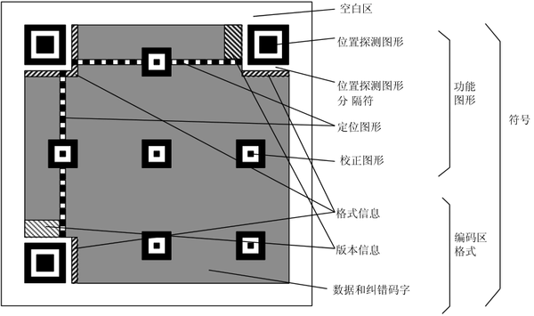
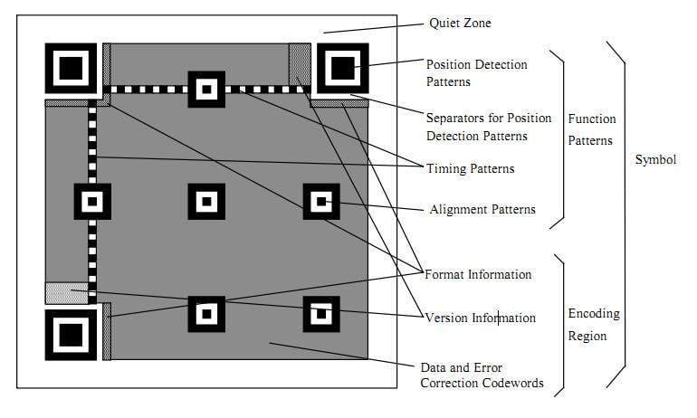

## 什么是二维码

* * *

二维条码是指在一维条码的基础上扩展出另一维具有可读性的条码，使用黑白矩形图案表示二进制数据，被设备扫描后可获取其中所包含的信息。一维条码的宽度记载着数据，而其长度没有记载数据。二维条码的长度、宽度均记载着数据。二维条码有一维条码没有的“定位点”和“容错机制”。容错机制在即使没有辨识到全部的条码、或是说条码有污损时，也可以正确地还原条码上的信息。二维条码的种类很多，不同的机构开发出的二维条码具有不同的结构以及编写、读取方法。

二维码又称QR Code，QR全称Quick Response，是一个近几年来移动设备上超流行的一种编码方式，它比传统的Bar Code条形码能存更多的信息，也能表示更多的数据类型：比如：字符，数字，日文，中文等等。

简单来说,二维码就是一种加密算法,可以实现快速的图形化解密错作.最近需要使用二维码的相关知识,所以在此处整理一下,以备日后查阅或他人查阅方便.

## 二维码的基本类型和结构

* * *

首先，我们先说一下二维码一共有40个尺寸。官方叫版本Version。Version 1是21 x 21的矩阵，Version 2是 25 x 25的矩阵，Version 3是29的尺寸，每增加一个version，就会增加4的尺寸，公式是：(V-1)_4 + 21（V是版本号） 最高Version 40，(40-1)_4+21 = 177，所以最高是177 x 177 的正方形。

下面我们看看一个二维码的样例：

### 定位图案

Position Detection Pattern是定位图案，用于标记二维码的矩形大小。这三个定位图案有白边叫Separators for Postion Detection Patterns。之所以三个而不是四个意思就是三个就可以标识一个矩形了。
Timing Patterns也是用于定位的。原因是二维码有40种尺寸，尺寸过大了后需要有根标准线，不然扫描的时候可能会扫歪了。
Alignment Patterns 只有Version 2以上（包括Version2）的二维码需要这个东东，同样是为了定位用的。

### 功能性数据

Format Information 存在于所有的尺寸中，用于存放一些格式化数据的。
Version Information 在 >= Version 7以上，需要预留两块3 x 6的区域存放一些版本信息。

### 数据码和纠错码

除了上述的那些地方，剩下的地方存放 Data Code 数据码 和 Error Correction Code 纠错码。

**未完待续...**
