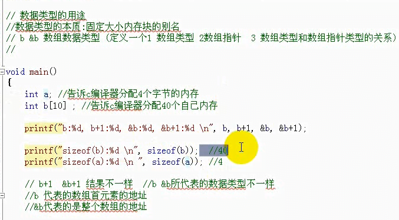
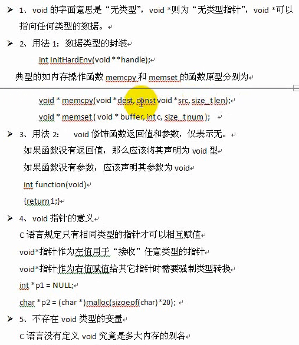
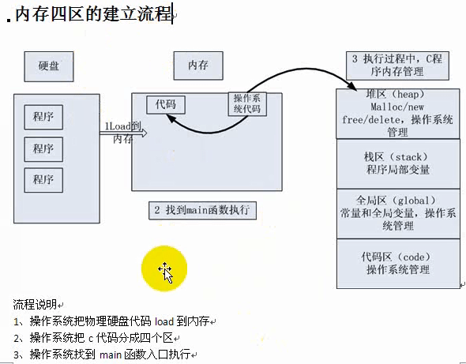
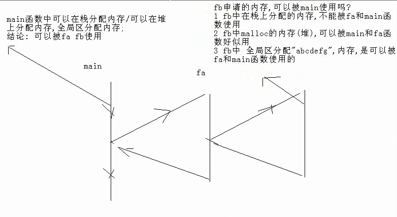
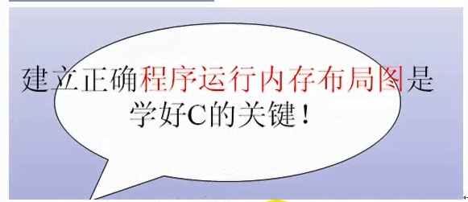
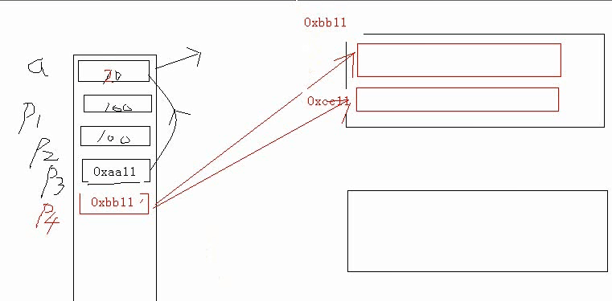

1.数组做函数参数,会退化为一个指针,正确的做法是:

int foo01(int a[])错误, int foo02(int *a)正确

把数组内存的首地址传递给函数

写在形参处的数组,如foo01,编译器会把它当成指针处理,只会分配一个首地址 

2.数组a[], a表示数组中第一个元素的地址,+1后移动单位长度,&a表示的是整个数组的长度,+1后移动整个数组的长度(单位大小*元素个数)

3.无类型指针操作数据的时候不考虑所操作的数据类型

4.修改数据是通过变量修改内存的数据,内存四区

5.栈内存放子函数,用完清空内存,堆内存放malloc申请的,由操作系统或者程序员free,不会清空.全局区同上图.

6.函数调用模型

6.从左向右横向看,是一个stack,先进的函数后清空数据,如图.每一个程序只有一个堆栈,一个exe文件中

7.指针*的含义

 

  

常量区数据不能被修改,如果通过指针强行修改,就会出错.程序无法运行,含义5
