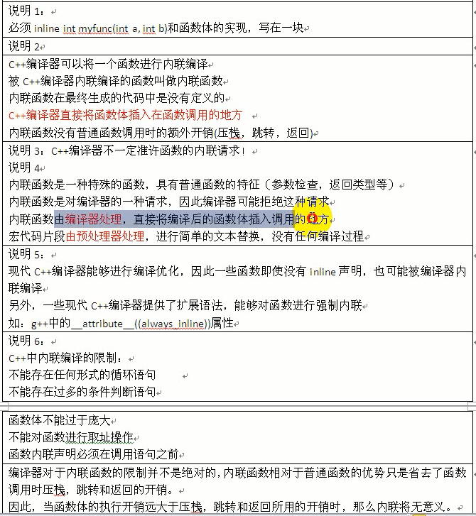
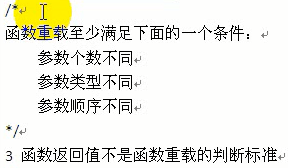
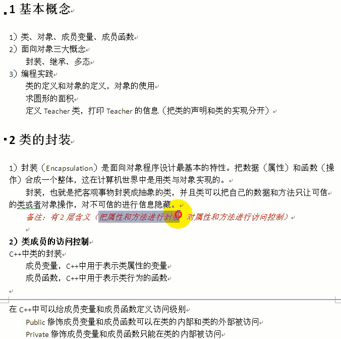
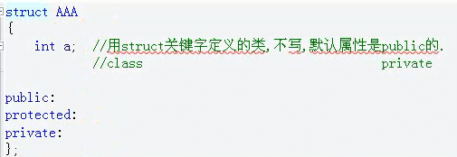

1.常引用

2.常引用直接引用字面量的时候无法修改

3.常引用的目的在于让某个变量拥有只读属性

4.内联函数需求原因

5.内敛函数定义方法

内敛函数不经过入栈出栈

  1. 函数重载,函数名字相同,但是每个相同名字函数的参数不相同

  1. 面向对象的基本概念

封装也就是说把类中的成员(属性)封装到函数中进行修改设置变更等操作

  1.  类的访问访问控制关键字

  1. struct和class的区别

  1. 类的声明和类的实现要分开,分到.h和.cpp不同的文件中

