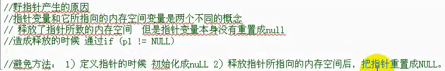
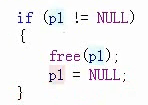
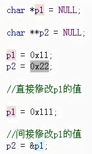
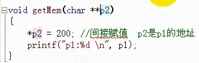
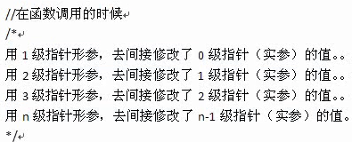
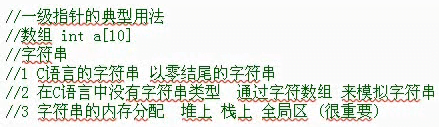
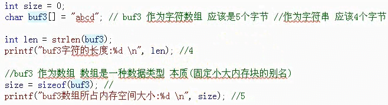
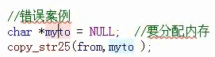
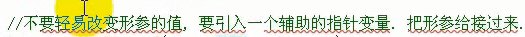

1.释放指针指向内存空间后还需要调整指针本身的值,如图(野指针)

2.修改一级指针所指向的值,要通过二级指针来修改.

如:

其中,*p1是一个确定的值a,而p1是a的地址,

p2是p1的地址(p2=&p1),要想修改p1的内容,则需要*p2=?来修改,等同于p1=?, 因为p1本身是个地址,指向确定的值a,则若想修改a的值,需要操作**p2,或者*p1.

 3.上一点中的p1和p2变量的数据类型分别为 char* 和 char** , 即,如果要在函数中传入实参,则形参的定义方法需要指定如上的数据类型,如图:

  1. 0级指针求地址变成1级指针,1级指针求地址变成二级指针,以此类推,其中1级指针和二级指针以及n级指针都是数据类型

  1. 指针的输入和输出特性.

输出特性:  通过指针修改实参的值

6.

C语言通过一级指针来制造出字符串类型的数据结构

以0结尾意思就是定义了一个定长的字符串,末尾元素未被使用,则编译器为其自动赋值为0,不是以0结尾是让编译器自动计算字符串数组的长度

7.数组名称,如果array[1000]中的array, 不能作为左值,即不能被修改

但是可以这样操作,  *(array+1)

  1. C风格的字符串结尾是以\0结束,如果缺少,则在用printf打印的时候,会出现烫烫烫... 打印格式printf("%s ", arrayString);  arrayString是数组字符串的名称

  2. (*a = *b)整个表达式的值就是 *a的值

    记得给子函数分配所需要操作的内存,如图:

