1.构造函数和析构函数(和类名相同的成员函数)

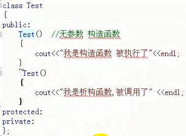

2.执行某个对象的时候,先自动执行构造函数,当对象运行结束后,运行析构函数

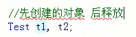

3.调用有参构造函数的方法

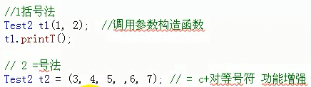

逗号表达式的值是最后一个的数的值,上是等号右边的值为7

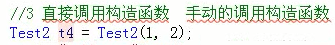

4. 

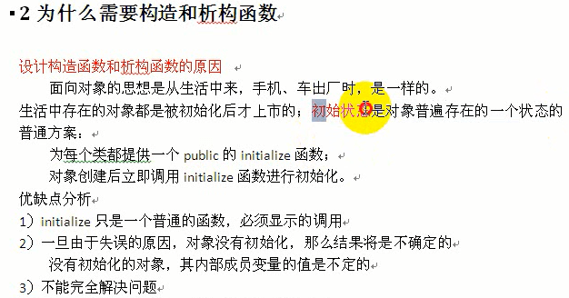

5.赋值构造函数用来使用另一个对象初始化一个新的对象

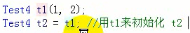

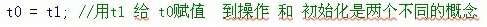

5.构造函数的调用规则

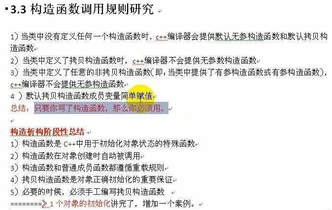

6.浅拷贝解决方案,手动编写构造函数

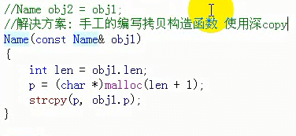

7.当一个类中的成员包含另一个类时,无法为其进行初始化,所以要用对象初始化列表

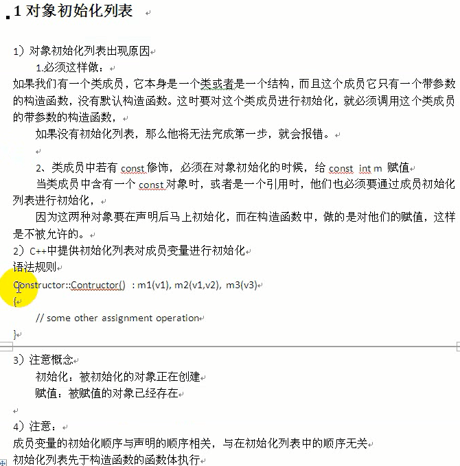

8.对象的动态建立和释放

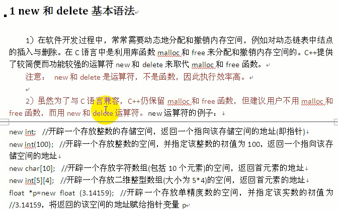

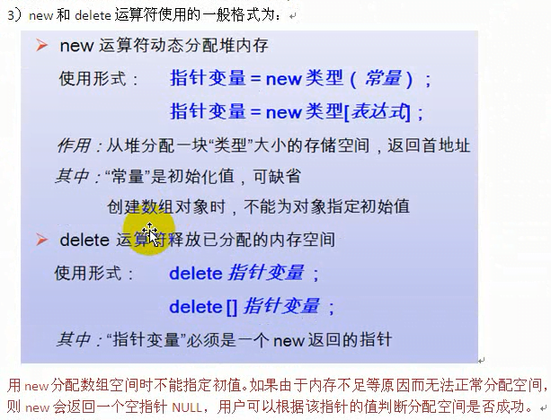

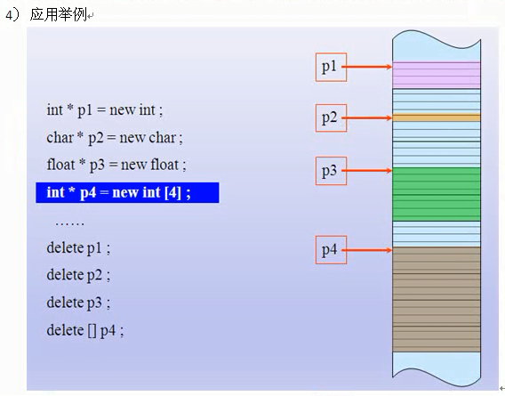

  1.  new分配基础类型

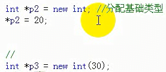

创建数组空间,

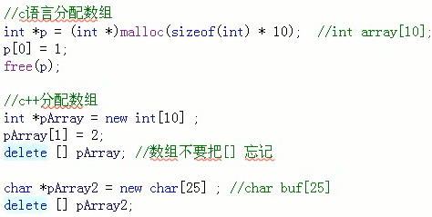

10.动态分配对象

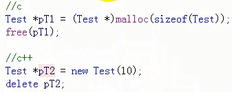

用new和delete来创建和删除动态对象

11.区别

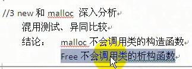

12.static修饰的变量(静态变量和静态成员函数)

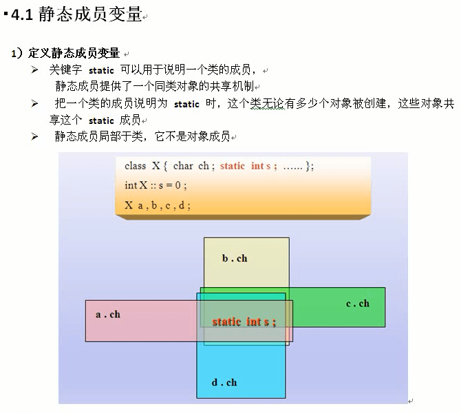

经过static修饰的变量或成员函数,则这个函数或者变量可以在这个类的所有实例化对象中使用,**但是需要在全局区中声明这个静态数据成员**

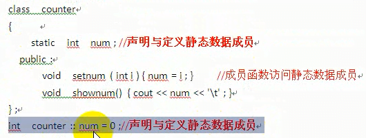

使用方法,

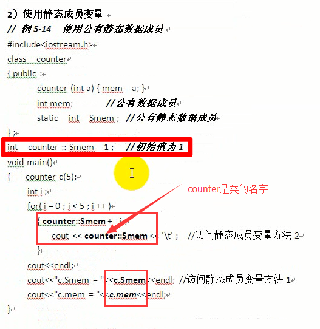
