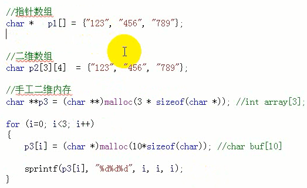
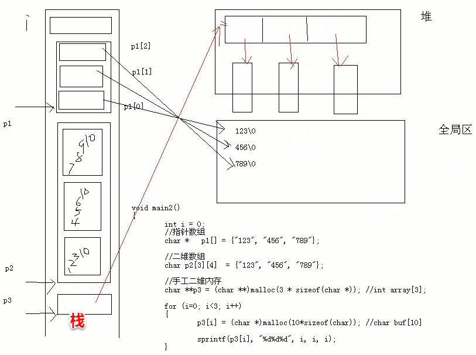
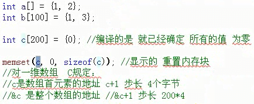
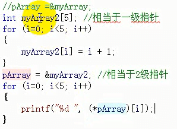
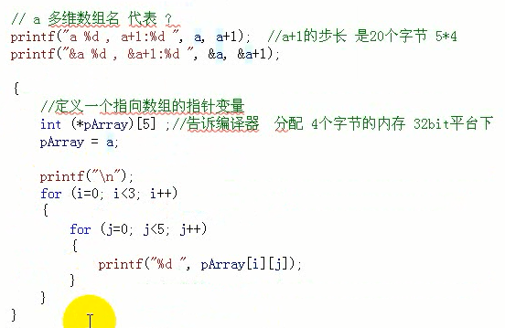
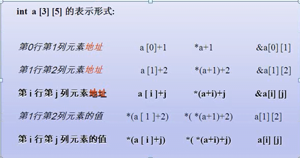

**1.传智播客扫地僧的视频课程总体来说还是非常棒的.但是!只能当做一个参考!参考!!适合自己查漏补缺,回忆之前的知识点.如果需要深度学习的话,还是要配合书籍以及在实际项目中的实践.**

2.C中被const所修饰的变量可以被指针通过他的地址修改

3.指针分配内存方式的不同

4.二级指针的模型

指针数组,

二维数组,

动态大小的数组,

 为每一行元素分配内存空间.

总共分为三种,分别如下图:

5.以上三种分配方式的内存模型:

6.在写函数的时候,用N级指针的形参,去改变N-1级指针的实参

7.为数组初始化内存

注意:memset()

  1. 可以通过typedef来自定义一个数组类型的数据结构别名

9.数组指针 指向一个数组的指针

创建一个数组类型的指针变量pArray,把这个变量指向一个数组的地址,就可以通过这个变量来操作这个数组了

10.直接typedef一个数组指针类型,就可以直接定义出一个指针类型

11.多维数组的名字,就相当于指针,它经过加一,就会跳到下一行

三种表示形式:

