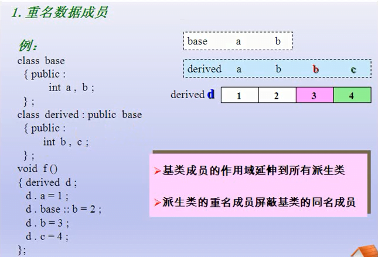

1.继承和派生

继承的基本语法,

2.基本概念

3.子类无法访问父类的私有成员,三个修饰符的访问控制

4.继承方式对属性的影响

5.兼容性原则

6.继承中的析构和构造函数

7.继承中的同名成员函数或者变量的处理方法

8.多继承的基本语法

**9.C++基础到此结束,还有一些概念需要在实际操作的时候详细学习,之后会发几篇专项学习的笔记,比如说容器,模版,异常,文件操作等等的文章.**

10.这次附加一个文件做文件上传测试

[start.cpp](../old_assets/e794b83204466ef06b7ceb04f3587eb5.cpp)
