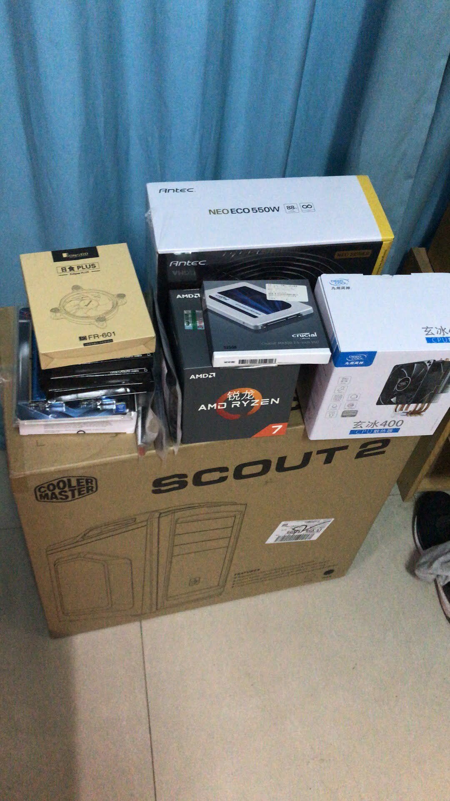
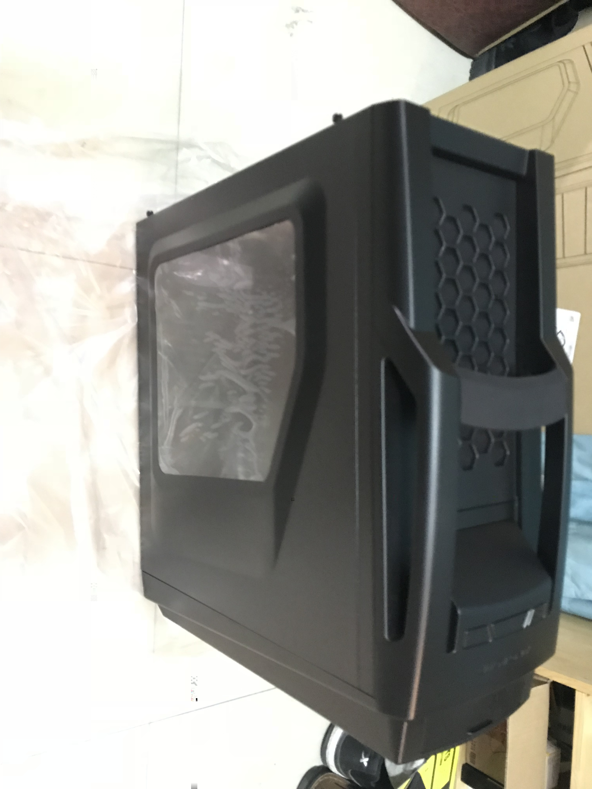
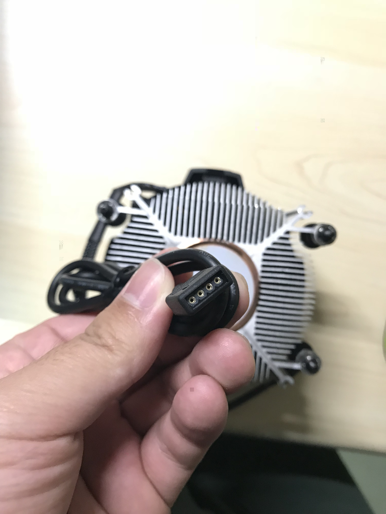
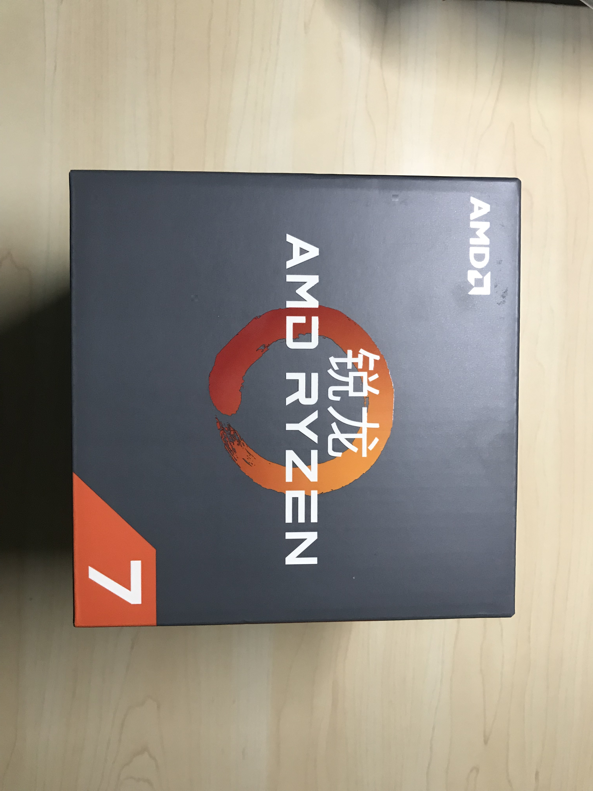

### 主机配置信息:

1.CPU AMD Ryzen 1700
2.主板 ASUS ROG STRIX B350-F GAMING
3.内存 G.Skill Ripjaws 4系列 DDR4 3000 8G*2
4.显卡 ASUS STRIX-GTX1050TI-4G-GAMING 1290~1392MHz
5.电源 Antec 额定550W 新模尊 Neo Eco 550W 80PULS 铜牌
6.硬盘(启动) 三星 PM961 256G PCIE
7.硬盘(加速) 英睿达(Crucial)MX300系列 525G SATA3
8.硬盘(存储) 希捷(SEAGATE)酷鱼系列 4TB 5400转256M SATA6Gb/s
9.机箱 酷冷至尊(CoolerMaster)侦察兵II
10.风扇 乔思伯12CM * 7

#### 装机前的全家福

#### 安装CPU主板内存电源,连接显示器测试开机

 

 

#### 给CPU涂散热硅脂,装入机箱中

#### 装机完成,整机功率正常50-70W,满载150W,功率相当滴了,已经记入了两个1080p的显示器的功率

#### 总结:购买后内存涨了30%... SSD涨了20%... 不亏 性价比极高
